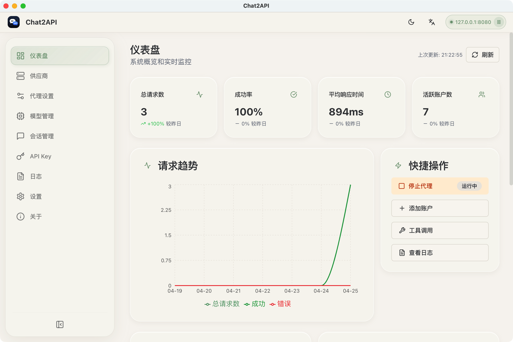
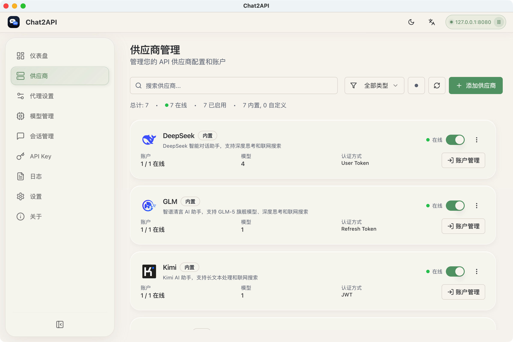
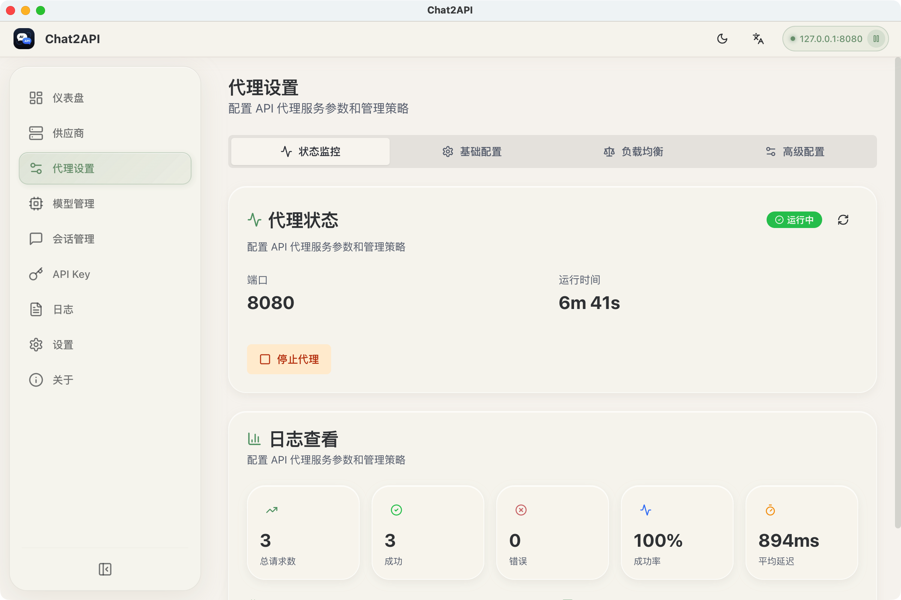
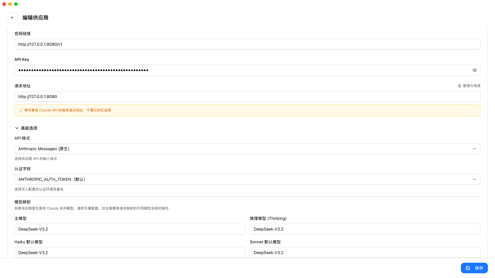

# Chat2API

<p align="center">
  
</p>

<p align="center">
  
  
  <br>
  <a href="https://www.electronjs.org/"></a>
  <a href="https://react.dev/"></a>
  <a href="https://www.typescriptlang.org/"></a>
  
</p>

<p align="center">
  <strong><a href="https://chat2api-doc.vercel.app/">官网</a> | <a href="https://chat2api-doc.vercel.app/docs">文档</a></strong>
</p>

<p align="center">
  <strong>多平台 AI 服务统一管理工具</strong>
</p>

<p align="center">
  Chat2API 通过各 AI 厂商的官方网页或 API 接入，为你提供零成本使用主流 AI 模型的能力，<br>
  并以 OpenAI 兼容 API 格式暴露本地服务，支持 DeepSeek、GLM、Kimi、MiniMax、Qwen、Z.ai 等厂商。
</p>



## ✨ 功能特点

- 🔄 **OpenAI 兼容 API**：提供标准 `/v1/chat/completions`、`/v1/models`、`/v1/completions` 接口
- 🤖 **Anthropic 兼容**：支持 `/v1/messages`（Anthropic Messages API），可直接配合 **Claude Code** 使用
- 📦 **多厂商支持**：DeepSeek、GLM、Kimi、MiniMax、Perplexity、Qwen、Z.ai 等
- 🧠 **智能上下文管理**：滑动窗口、Token 限制、摘要策略
- 🛠️ **函数调用支持**：通过提示词工程为所有模型提供通用工具调用能力
- 🗺️ **模型映射**：灵活的模型名称映射，支持通配符和首选供应商/账号选择
- 📊 **仪表板监控**：实时请求流量、Token 用量、成功率
- 🔑 **API Key 管理**：生成和管理本地代理密钥
- 📋 **请求日志**：详细的请求日志，便于调试和分析
- ⚖️ **负载均衡**：多账号负载均衡和健康检查机制
- 🖥️ **桌面原生体验**：支持系统托盘、深色/浅色主题、中英文切换

## 📸 界面预览

| 仪表板 | 提供商管理 |
|--------|-----------|
|  |  |

| 代理配置 | CC-Switch 接入配置 |
|---------|-------------------|
|  |  |

## 🤖 支持的厂商

| 厂商 | 认证方式 | OAuth | 模型 |
|------|---------|-------|------|
| DeepSeek | User Token | ✅ | DeepSeek-V3.2 |
| GLM（智谱） | Refresh Token | ✅ | GLM-5 |
| Kimi（月之暗面） | JWT Token | ✅ | kimi-k2.5 |
| MiniMax | JWT Token | ✅ | MiniMax-M2.5 |
| Perplexity | JWT Token | ✅ | Sonar, Sonar Pro, Sonar Deep Research |
| Qwen（国内） | SSO Ticket | ✅ | Qwen3.5-Plus, Qwen3-Max, Qwen3-Flash, Qwen3-Coder, qwen-max-latest |
| Qwen AI（国际） | JWT Token | ✅ | Qwen3.5-Plus, Qwen3-Max, Qwen3-VL-Plus, Qwen3-Coder-Plus, Qwen-Plus, Qwen-Turbo |
| Z.ai | JWT Token | ✅ | GLM-5, GLM-4.7, GLM-4.6V, GLM-4.6 |

## 📥 安装

### 下载安装

从 [GitHub Releases](https://github.com/xiaoY233/Chat2API/releases) 下载对应平台的安装包：

| 平台 | 文件 |
|------|------|
| macOS（Apple Silicon） | `Chat2API-x.x.x-arm64.dmg` |
| macOS（Intel） | `Chat2API-x.x.x-x64.dmg` |
| Windows | `Chat2API-x.x.x-x64-setup.exe` |
| Linux | `Chat2API-x.x.x-x64.AppImage` 或 `.deb` |

### 从源码构建

**环境要求：** Node.js 18+、npm、Git

```bash
git clone https://github.com/xiaoY233/Chat2API.git
cd Chat2API
npm install
npx electron-vite dev 2>&1
```

### 生产构建

```bash
npm run build              # 构建应用
npm run build:mac          # 构建 macOS（dmg, zip）
npm run build:win          # 构建 Windows（nsis）
npm run build:linux        # 构建 Linux（AppImage, deb）
npm run build:all          # 构建所有平台
```

## 🚀 使用指南

### 第一步：启动应用

安装后启动 Chat2API，进入主仪表板。

### 第二步：添加提供商

1. 在侧边栏进入 **提供商管理**
2. 点击 **添加提供商**
3. 选择内置提供商（如 DeepSeek）
4. 填入认证凭证

> **获取 DeepSeek Token 示例：**
> 1. 访问 [DeepSeek Chat](https://chat.deepseek.com/)
> 2. 开始任意对话
> 3. 按 `F12` 打开开发者工具
> 4. 进入 **Application** > **Local Storage**
> 5. 找到 `userToken` 并复制其值

### 第三步：配置代理

1. 在侧边栏进入 **代理设置**
2. 设置端口（默认 8080）
3. 选择负载均衡策略：
   - **轮询（Round Robin）**：均匀分配请求
   - **优先填充（Fill First）**：用满一个账号再切换
   - **故障转移（Failover）**：失败时自动切换
4. 点击 **启动代理**

### 第四步：测试 API

使用 Python（OpenAI SDK）：

```python
from openai import OpenAI

client = OpenAI(
    api_key="your-api-key",
    base_url="http://localhost:8080/v1"
)

response = client.chat.completions.create(
    model="DeepSeek-V3.2",
    messages=[
        {"role": "user", "content": "你好，你是谁？"}
    ]
)

print(response.choices[0].message.content)
```

### 第五步：管理 API Key（可选）

1. 进入 **API 密钥** 页面
2. 点击 **新建 API Key**
3. 输入名称和描述
4. 复制生成的密钥

## 🔧 在 CC-Switch 中配置 Chat2API

[CC-Switch](https://github.com/farion1231/cc-switch) 是一个管理 Claude Code、Codex、Gemini CLI 等 AI 编程工具的桌面应用。Chat2API 已原生支持 Anthropic Messages API，可通过 CC-Switch 直接配合 **Claude Code** 使用。

### 配置步骤

1. 打开 CC-Switch → 点击 **"Add Provider"**（添加提供商）
2. API 格式选择 **"Anthropic Messages (原生)"**
3. 填写配置：
   - **请求地址**：`http://127.0.0.1:8080`
   - **API Key**：你在 Chat2API 中配置的 API Key（如关闭认证可留空）
4. 点击 **"Enable"**（启用）


> **提示**：配置完成后，可在 CC-Switch 中点击 "Speed Test" 测试连通性，或直接在 Claude Code 中发起请求验证。

## 📖 API 文档

### 支持的接口

| 端点 | 说明 |
|------|------|
| `POST /v1/chat/completions` | OpenAI 聊天补全（支持流式和非流式） |
| `POST /v1/completions` | 文本补全（自动转为聊天格式） |
| `GET /v1/models` | 获取所有可用模型列表 |
| `POST /v1/messages` | **Anthropic Messages API**（支持 Claude Code 原生接入） |

### 管理 API

启用管理 API 后，可在 `/v0/management` 路径程序化管理供应商。

## ⚙️ 设置

- **端口**：代理监听端口（默认 8080）
- **路由策略**：轮询 / 优先填充 / 故障转移
- **自动启动**：应用启动时自动开启代理
- **主题**：浅色 / 深色 / 跟随系统
- **语言**：中文 / English

## 🏗️ 项目架构

```
Chat2API/
├── src/
│   ├── main/                    # Electron 主进程
│   │   ├── index.ts            # 应用入口
│   │   ├── tray.ts             # 系统托盘
│   │   ├── proxy/              # 代理服务器
│   │   ├── ipc/                # IPC 通信
│   │   └── utils/              # 工具函数
│   ├── preload/                # 上下文桥接
│   └── renderer/               # React 前端
│       ├── components/         # UI 组件
│       ├── pages/              # 页面组件
│       ├── stores/             # Zustand 状态管理
│       └── hooks/              # 自定义 Hooks
├── build/                      # 构建资源
└── scripts/                    # 构建脚本
```

## 🔧 技术栈

| 组件 | 技术 |
|------|------|
| 框架 | Electron 33+ |
| 前端 | React 18 + TypeScript |
| 样式 | Tailwind CSS |
| 状态管理 | Zustand |
| 构建 | Vite + electron-vite |
| 打包 | electron-builder |
| 服务端 | Koa |

## 📁 数据存储

应用数据存储在 `~/.chat2api/` 目录下：

- `config.json` — 应用配置
- `providers.json` — 供应商设置
- `accounts.json` — 账号凭证（加密）
- `logs/` — 请求日志

## ❓ 常见问题

### macOS 提示"应用已损坏，无法打开"

由于 macOS 安全机制，从 App Store 外下载的应用可能触发此警告。执行以下命令修复：

```bash
sudo xattr -rd com.apple.quarantine "/Applications/Chat2API.app"
```

### 如何更新？

在 **关于** 页面检查更新，或从 [GitHub Releases](https://github.com/xiaoY233/Chat2API/releases) 下载最新版本。

## 🤝 贡献指南

1. Fork 本项目
2. 创建功能分支（`git checkout -b feature/amazing-feature`）
3. 提交更改（`git commit -m 'Add amazing feature'`）
4. 推送分支（`git push origin feature/amazing-feature`）
5. 发起 Pull Request

## 📄 开源协议

GNU General Public License v3.0，详见 [LICENSE](LICENSE)。

- ✅ 可自由使用、修改和分发
- ✅ 衍生作品必须以相同协议开源
- ✅ 必须保留原始版权声明

## 🙏 致谢

- [Electron](https://www.electronjs.org/) — 跨平台框架
- [React](https://react.dev/) — UI 框架
- [TypeScript](https://www.typescriptlang.org/) — 类型安全的 JavaScript
- [Tailwind CSS](https://tailwindcss.com/) — CSS 框架
- [Zustand](https://zustand-demo.pmnd.rs/) — 状态管理
- [Koa](https://koajs.com/) — HTTP 服务器
